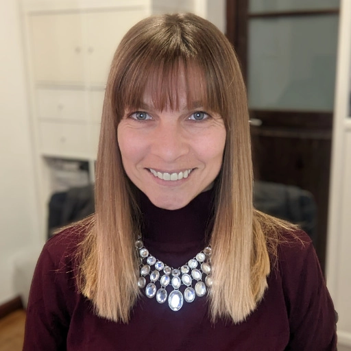
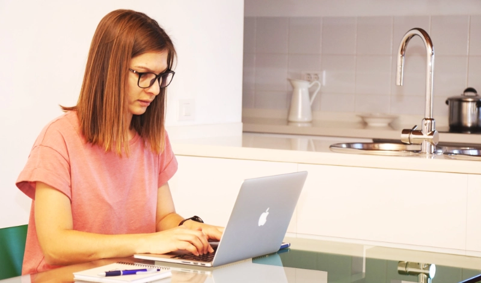

# About me

## Welcome, I am **Anelia** (She/Her)

{ align=left . width="200"}

I’m a designer who started with industrial design and then transitioned to digital product design. 

I have a passion for creating products that are functional, simple, and powerful, and that can be improved by investigation and testing. I have worked on a lot of interesting projects, and I love to accuire new skills and tools to enhance my design work.

## My Background

Ever since I was a kid, I was fascinated by architecture and design. I wanted to be an architect and create beautiful and functional buildings. However, I ended up studying industrial design instead. I was very lucky to find a captivating career that was interesting and creative, two things that have always been very important to me.

After finishing my design career, I joined a scholarship at a local institution that opened a world of opportunities for design for me. I got to work on different types of projects, from paper flyers to complicated web design projects. I was able to try on a lot of different challenges and some of them are still used to this very day.

Later on, in my Master's Degree, I discovered responsive web design, UX, UI, and HCI design fields, and I fell in love with the ability to make products that are never actually finished, nor done, but can be only improved by investigation and testing. I love that part of digital product design, and I decided to pursue it as my main focus.

> I truly believe that nothing is impossible.

{ align=right . width="400"}

### Design Philosophy and Style

My design philosophy is based on the idea that design should be fun, functional, and user-centric. I believe that design should solve problems, enhance experiences, and create value for both the users and the clients. I also believe that design should be simple, but not simplistic, and that every element should have a purpose and a meaning.

My design style is influenced by my industrial design background, where I learned to appreciate the beauty and elegance of minimalism, geometry, and contrast. I also like to experiment with vivid and saturated colors, and to add some originality and personality to my work. I admire designers who can combine functionality, simplicity, and power in their work, such as Dieter Rams, Jony Ive, and Paula Scher.

{ align=left . width="250"}

### Fun stuff

My geeky nature and stubborness enhance my problem-solving skills, bringing a unique perspective and insatiable curiosity to each project. This drive to explore and invent enables me to address software and interface challenges and play with different solutions, until  I find the most suitable one for the situation.

 

## Hobbies and Interests

{ align=right . width="300"}

- **Cooking**:  
    I love to cook delicious and nutritious food for myself and my loved ones. I like to follow the latest and greatest food trends, and I also like to experiment with different cuisines, ingredients, and techniques. I have a special interest in nutrition, and I try to balance my diet and avoid unnecessary fats and sugars. One of my recent achievements was mastering the ability to make Neapolitan pizzas at home for parties, and they were a huge success.
- **Reading**:  
     I love to read books that enrich my design knowledge and help me understand better human actions. I love everything related to psychology, neuroscience, and behavioural psychology. I enjoy reading and listening to audiobooks on those themes.
- **Travelling**:  
    Since I don’t live in the same country as my parents and relatives, I travel to visit and keep in touch with them. I also love to travel and to discover new places, cultures, and people. Traveling also helps me to broaden my horizons, to appreciate diversity, and to challenge myself. Some of the places that I have visited are Sweden, Denmark, Mexico, USA, Canada, and of course Spain.

## Goals and Dreams
As a designer, I have some goals and dreams that I want to achieve and pursue. Some of them are:

- Work on a big and complex project: I would like to work on a project that is so big and complex that it takes a long time to understand it and to design for it. I enjoy doing the hard work of researching, analyzing, and synthesizing information, and I find it very rewarding when I can create a solution that is simple, elegant, and effective. I also like to work with like-minded people who share my passion and vision, and who can challenge and support me.
- Create a positive impact: I would like to work on a project that can create a positive impact and value for the users, the clients, and the society. I want to use my design skills and knowledge to solve real problems, to enhance lives, and to make a difference. I also want to use my design work to express my values and beliefs, and to inspire and influence others.
- Keep learning and growing: I would like to keep learning and growing as a designer and as a person. I want to stay on top of the latest trends and innovations in the design field, and to always learn new skills and tools that can help me improve my work. I also want to keep exploring new domains and disciplines that can enrich my design work and my life.

--- 

Feel free to reach out and discuss your design needs or simply to talk about the latest tech trends.

I’m always up for an exciting conversation and the opportunity to explore new frontiers of problem-solving.

Let’s make magic happen! 

[Contact](mailto:anelia.em.stoyanova@gmail.com){ .md-button }

--- 

## Career timeline