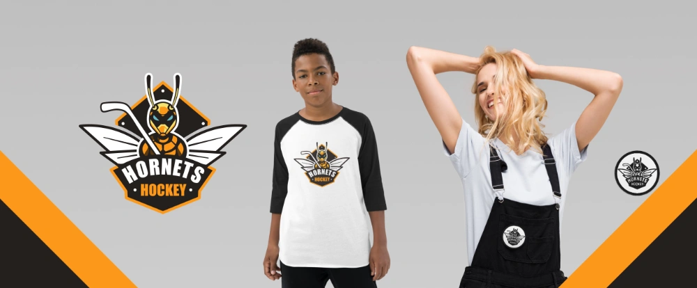
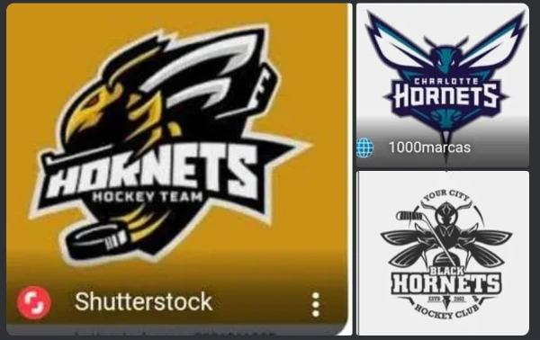

# Hornets Hockey

{ .postCover }

## Project Summary

-   :material-badge-account:{ .middle .iconSummary }  __Client__

    ---

    **Hornets Hockey**  
    Roller Hockey Kids Club

-   :material-calendar-expand-horizontal:{ .middle .iconSummary }  __Timeline__

    ---

    17 Jul 2023  
    1 day

-   :material-face-woman-shimmer:{ .middle .iconSummary }  __Role__

    ---

    - Branding Designer

-   :material-bullseye-arrow:{ .middle .iconSummary }  __Technology__

    ---

    - Midjourney v4 
    - Affinity Designer v2.0 on iPad

## Crafting the Hornets Hockey Logo with AI

A friend of mine decided to create a Roller Hockey kids club. She needed a logo and asked for help. Since I had the Midjourney (MJ) subscription, I decided to give it a try. It was a completely new concept for me, leveraging all the efforts to AI and trying to come up with something good enough so it can become the club's brand.

### Brainstroming and concept

First things first, we kick off with brainstorming. It's crucial to nail down the logo style we're after. My friend already chose a bunch of Hornets hockey logos and shared them with me.

{ align=left .width50}

With my MJ subscription in hand, I explored different concepts, taking into consideration the desired identity, spirit, and the essence of hockey. This initial phase laid the foundation for the elements that would later come together in the final logo.

Here is a small sample of the different ideas that came up:

### Image Generation with MJ

After thoughtful consideration, I selected a couple of styles that looked promising and started more detailed-oriented generation. Here are a few examples.

    

        
    

    

        
    

    

        
    
    

At this point, I could explore different shapes, styles, and colors. This iterative process played a crucial role in shaping the final design.

### Selecting the parts

In this process, I found myself drawn to specific elements in different images. Some had a beautiful body shape, while in others, the head of the character was achieved better. In all versions, the hornet wings were just too weird, so I had to create them separately.

    

        
    

    

        
    

    

        
    
    

    

        
    

    

        
    

    

        
    
    

Making sure that every aspect of the logo was at the same level of detail, I selected and organized these standout parts. Afterwards, I created a new character using a collage technique in Affinity Designer on iPad, and sent it for approval to my friend.

Once I got the "OK!", I could proceed to vectorizing the final shape and defining the branding elements in more detail.

### Vectorization and simplification

This step is crucial in every branding image creation. It ensures that the final shape is refined and detailed, and most of all, scalable.

One requirement for this particular case, since the beginning, was to make it possible to be embroidered on a patch.

## Final thoughts

While it might not be the ultimate, flawless logo in the entire universe, the real takeaway here is the process. Thanks to MJ, I was able to speed up the creation process significantly. I was able to define a final image, create a completely unique character from nothing, choose different elements that looked nice to me, and offer a final proposal in just one day. Yes, 24 hours!

I don't know if I am going to do it again; that's for the future to decide. At this point, AI definitely helped find an acceptable solution for the situation, and I am very grateful I could experiment and do it.